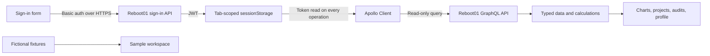

# Architecture

Graphite is a read-only client for the Reboot01 learning API. Next.js renders the public shell; the authenticated dashboard loads in the browser. A separate sample route makes the interface reviewable without credentials.

## Boundaries

| Area                             | Responsibility                                                                         |
| -------------------------------- | -------------------------------------------------------------------------------------- |
| `src/lib/auth.ts`                | UTF-8 credential encoding, sign-in, session storage, expiry checks                     |
| `src/lib/apollo.ts`              | Per-request authorization, a 20-second request timeout, expiry events, in-memory cache |
| `src/graphql/dashboard-query.ts` | One typed dashboard operation with a consistent module scope                           |
| `src/lib/dashboard.ts`           | Pure, independently tested aggregation and formatting                                  |
| `src/lib/demo-data.ts`           | Explicit fictional sample data, never an API error fallback                            |
| `src/components/Dashboard.tsx`   | Workspace navigation, project filtering, audit history, and account details            |
| `src/components/Charts.tsx`      | XP history and skills visualization, with exact data alternatives                      |
| `src/components/Motion.tsx`      | Hero parallax and progressive section motion                                           |
| `src/app/profile/page.tsx`       | Session guard, query lifecycle, refresh, logout, and failure states                    |

## Authentication and privacy

- The password is sent directly to the configured Reboot01 HTTPS endpoint and is not written to storage, logged, or sent to an app-owned server.
- The JWT lives in `sessionStorage`, which normally lasts for the current browser tab. The previous application's `localStorage.authToken` is removed on successful sign-in and logout.
- Client-side JWT decoding checks format and expiry only. **Reboot01 verifies the token and enforces authorization.** A client-side route guard is not an authorization boundary.
- Browser storage is accessible to JavaScript on the same origin. A deployment that requires stronger session isolation should use a trusted backend with HttpOnly cookies; it must also address CSRF and upstream API access.
- Apollo reads the latest token before every operation. Invalid JWT and HTTP 401 responses clear the session; the profile page clears cached data and returns to sign-in. A periodic and focus check also detects expiry.
- Ordinary connection errors retain the last loaded live data for retry. No API failure silently switches to sample data.
- Real learner data is not embedded in the static build. The `/demo/` route contains only the clearly labeled fixtures in `demo-data.ts`.
- Account details retain the original profile fields but are collapsed by default.

## Data semantics

See [the data contract](data-contract.md) for the query scopes and calculations. The important design decision is that XP shown in the overview, breakdown, and timeline refers to the same module event. Piscine XP is displayed separately.

## Motion

The dashboard uses Framer Motion for a small, scroll-linked image translation and scale. Section entry uses CSS view timelines where supported, with a readable static fallback. There is no scroll hijacking or mandatory pinned section in the working dashboard.

The pause control stops decorative motion for the current page. The operating system's reduced-motion preference takes precedence; charts, CSS transitions, and the hero respect it. Native scrolling, keyboard navigation, and anchor links remain available.

## Deployment

The regular `npm run build` / `npm start` workflow retains Next.js hosting compatibility, including Vercel. `npm run build:static` creates `out/` for static hosting by setting a build-only environment variable. The two outputs use the same source and API client.

The `.openai/hosting.json` file identifies the owner's private Sites preview and declares `out` as the static output. It contains no credentials. A fork should obtain its own Sites project identifier before deploying through Sites.

## Verification limits

The automated tests use mocked authentication and GraphQL transports and real pure calculation functions. They do not log in to a real Reboot01 student account. Live compatibility still depends on the upstream schema, permission rules, and CORS policy. Browser interaction and visual regression tests are not part of the included suite.
